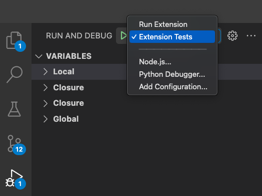
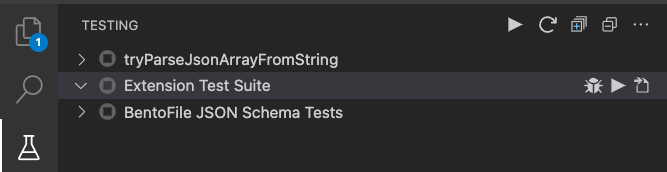
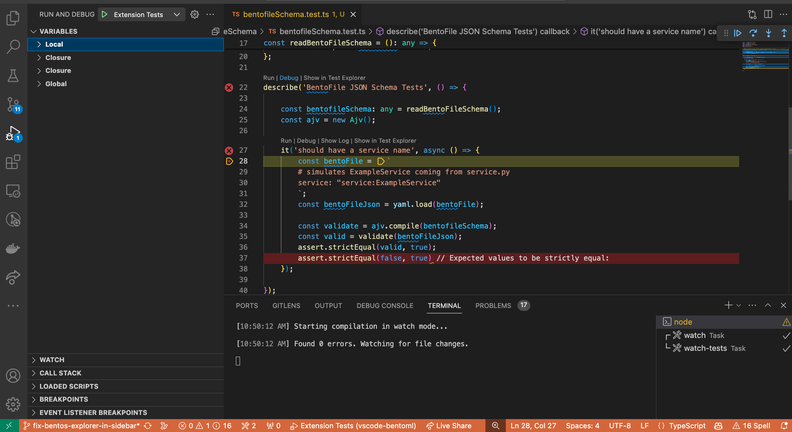
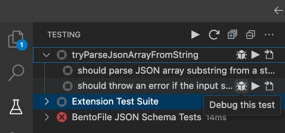
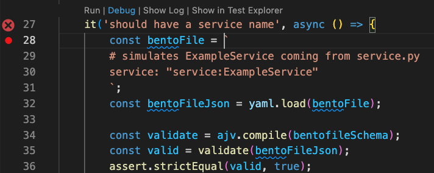

[](./LICENSE)

[](https://github.com/mlops-club/vscode-bentoml/actions/workflows/build-test-lint-publish.yaml)
[](https://codecov.io/gh/mlops-club/vscode-bentoml)

# `vscode-bentoml`

A VS Code extension inspired by the Docker extension that provides

1. auto-completion for BentoML YAML files
2. a UI interface over the `bentoml` CLI

## Onboarding to the Team

- Gain access to this Notion doc: https://www.notion.so/shilongjaycui/BentoML-VS-Code-Extension-2cabc38ceae74181bf3544993d123903?pvs=4
  - The Notion doc contains external links such as the Slack channel in which the team members communicates with one another.
  - If you don't have access to this Notion doc, send a request to Jay at `shilongjaycui@gmail.com`.

## How this extension fits into a Cloud or on-prem Architecture

<!--  -->

## Contributing

### CI tooling

- `.c8rc.json` is for a code coverage tool called `c8`.
- `.eslintrc.json` configuration file for a TypeScript linting tool called ESLint.
- `src/test` tests
- `.vscodeignore` excludes files from ending up in the built extension published to the marketplace.
- `.prettierrc` is for a TypeScript formatting tool called `prettier`.

### Running the extension locally

VS Code makes it really easy to run extensions and try out code changes:

1. be sure you have NodeJS installed, some had issues because they had the wrong Node version
2. go to the `src/extension.ts` file and press `F5` to start a debugging session

### Getting up to speed

#### What is BentoML?

The [BentoML docs](https://docs.bentoml.com) are the best place to start.

#### Writing VS Code Extensions

> ⚠️ **Warning** these videos are about a different VS Code Extension for a tool called ClearML--the project this repo is a fork of. By watching these videos, you can learn a lot about how VS Code extensions are structured.

Here are a few videos with progress updates. Watching these will step you through how we learned about authoring VS Code extensions and how we got to where we are now.

1. ~30 min - [Announcing the hackathon project](https://youtu.be/YddCUa-5yVI)
1. ~30 min - [How we got the extension to work with the Python interpreteer by forking the `vscode-black-formatter` extension](https://youtu.be/_FyadEJFRiM)
1. ~45 min - [Everything we created/learned during the all-nighter hackathon](https://youtu.be/fKTldHV_0Y0)
   - how to hit the ClearML API
   - how to read the `~/clearml.conf` file with TypeScript
   - how we decided to hit the ClearML API from TypeScript rather than Python
   - how we got the list items to show up in the sidebar
1. [Pull request](https://github.com/mlops-club/vscode-bentoml/pull/3): giving ClearML it's own "View Container" i.e. item
   in the leftmost sidebar. And how we got our icons to show up
   in all the right places.
1. ~5 min - [How we got VS Code to open a new window SSH'ed into an already-attached-to ClearML session](https://youtu.be/xmvlbjE0F1g)

### Running the extension locally

> 📌 **Note:** As a first contribution, it'd be great if you submitted a PR to this README if you get stuck during setup.

> ⚠️ **Disclaimer:** expect problems if you try to run this project directly on Windows.
>
> Install the Windows Subsystem for Linux 2 (WSL2) and develop from there if
> you are running windows.
>
> The free videos in the [`Environment Setup` section of this
> course](https://www.udemy.com/course/setting-up-the-linux-terminal-for-software-development/) walk you through how to do this, as well as most of step [1] below.

1. install the prerequisites
   1. `docker`, on MacOS and Windows (including WSL2), get [Docker Desktop](https://www.docker.com/products/docker-desktop/)
   2. `docker-compose`, e.g. `brew install docker-compose`
   3. NodeJS, e.g. with `brew install nodejs`
   4. Python. `pyenv` is a good way to install Python.
   5. VS Code
1. clone the repo
1. install the NodeJS dependencies
   ```bash
   # cd into the cloned repo and install the NodeJS dependencies
   cd ./vscode-bentoml/
   npm install
   ```
1. start the VS Code extension by opening `./src/extension.ts` and pressing `F5` on your keyboard
1. The extension should load successfully, but it won't have any sessions. To start a session, run

   ```bash
   # install the clearml-session CLI into a Python virtual environment
   python -m venv ./venv/
   source ./venv/bin/activate
   npm run install-python-deps
   ```

### Testing: Writing, running, and debugging tests

#### The `mocha` testing framework

VS Code's extension template from which this project was generated uses the Mocha testing framework.

Although Mocha isn't strictly required, one of the benefits that we get for going with the testing
framework from the template is that

The [docs for testing VS Code extensions are here](https://code.visualstudio.com/api/working-with-extensions/testing-extension).

#### Run all tests

To run all tests, you can do.

```bash
npm run test
```

#### Run all tests, and set a breakpoint

`npm run test` does not stop at breakpoints. To run all tests while respecting breakpoints, select the `"Extension Tests"` launch configuration in the "Run and Debug" sidebar.

Then press the green "Play" button or press `F5`.



> 📌 Note: If you want to make `F5` run the extension and not the tests, you will need to reselect the `"Run Extension" launch configuration in the "Run and debug sidebar".

#### Run a single test (or groups of tests) -- including breakpoints

The easiest way to do this is using the Mocha Test Explorer extension.

We've configured the project's `settings.json` to use the Mocha Test Explorer extension.

1. Install the [Mocha Test Explorer extension](https://marketplace.visualstudio.com/items?itemName=hbenl.vscode-mocha-test-adapter) in VS Code (extension id: `hbenl.vscode-mocha-test-adapter`)
   This will allow VS Code's test explorer to show the tests.

   

2. Try setting a break point in a test!

   

To trigger your break point, you can run all tests, or select a test (or group of tests) in the Test Explorer


Or you can click the context action button above a test in code!

